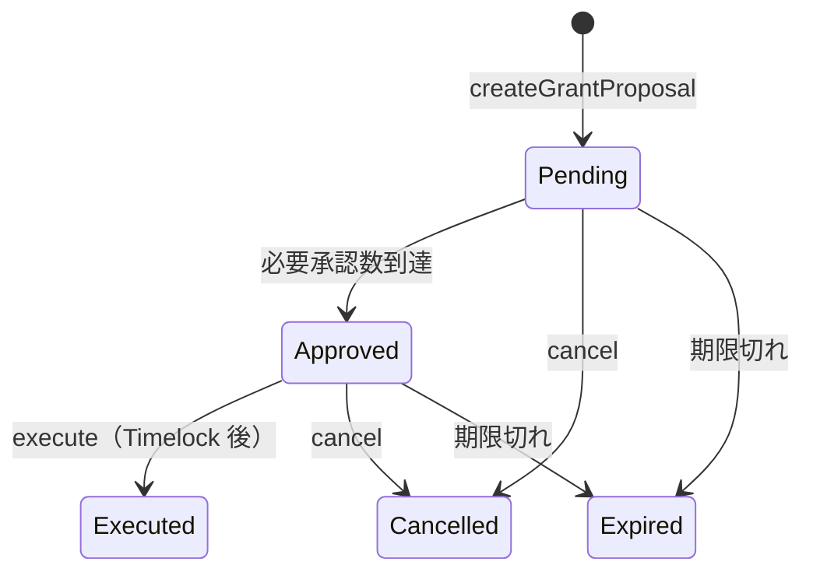

# FundOS — 特定目的基金（Phase 1 MVP）

**寄付者が回収できず、管理者も単独で資金を抜けない、監査可能な JPYC 基金の最小安全構成。**

FundOS は ERC-4626 の換金可能ボルトではありません。保全元本と支出可能予算を分離し、承認済み助成 Proposal の実行以外では JPYC が外部へ流出しないことをコントラクトで保証します。

## FundOS の目的

高専生の活動支援など、**特定の公益目的**に資金を拘束するオンチェーン基金です。

- 寄付は不可逆（返金・引出・持分トークンなし）
- 助成は支出可能予算のみから実行
- 複数承認 + Timelock 後にのみ送金
- 緊急停止で外向き資金移動を遮断
- 現フェーズでは外部 DeFi 運用なし

## ERC-4626 Vault との違い

| 項目 | ERC-4626 Vault | FundOS Phase 1 |
|---|---|---|
| 寄付の扱い | `deposit` / `mint` で持分取得 | `donatePrincipal` / `fundGrantBudget`（不可逆） |
| 引出 | `withdraw` / `redeem` 可能 | **不可** |
| 持分トークン | ksJPYC 等を発行 | **発行しない** |
| 資金流出 | 保有者・管理者経路があり得る | **`executeGrantProposal` のみ** |
| 会計 | `totalAssets()` 中心 | 保全元本 + 支出予算の二層会計 |
| 外部運用 | yieldSink / deployYield | **Phase 1 では未実装** |

## コントラクト構成

```
FundConstitution.sol   … 基金名・目的ハッシュ・JPYC アドレス等（デプロイ後不変）
TreasuryVault.sol      … JPYC 保管・会計・送金実行（GrantController のみ）
GrantController.sol    … 助成 Proposal の作成・承認・実行・緊急停止
```

### 保全元本 (`protectedPrincipal`)

```solidity
donatePrincipal(uint256 amount, bytes32 donorRef)
```

- 誰でも実行可能
- 返金不可・引出不可・助成に使用不可
- `donorRef` は個人を特定しないハッシュのみ

### 支出可能予算 (`availableGrantBudget`)

```solidity
fundGrantBudget(uint256 amount, bytes32 sourceRef)
```

- 誰でも実行可能
- **助成実行時のみ**消費される
- 返金不可

### 会計不変条件

```text
JPYC 実残高 >= protectedPrincipal + availableGrantBudget
```

超過分は `accountingSurplus`（誤送金等）。Surplus を管理者が引き出す機能はありません。

## 助成 Proposal ライフサイクル



1. **Proposer** が Proposal 作成（recipient / amount / purposeId / evidenceHash / metadataURI）
2. **Approver** が承認（自己承認・二重承認不可）
3. 必要承認数に達すると **Approved**、`executableAt = now + timelock`
4. **Executor** が Timelock 経過後・期限内に `executeGrantProposal`
5. Treasury から recipient へ JPYC 送金、`availableGrantBudget` を減算

## 権限モデル（AccessControl）

| Role | 権限 |
|---|---|
| `DEFAULT_ADMIN_ROLE` | Role 管理のみ（送金不可） |
| `PROPOSER_ROLE` | Proposal 作成 |
| `APPROVER_ROLE` | Proposal 承認 |
| `EXECUTOR_ROLE` | 承認済み Proposal の実行 |
| `GUARDIAN_ROLE` | **緊急停止のみ**（解除不可） |
| `CONFIG_ROLE` | 上限・承認数・Timelock・有効期間の変更、停止解除 |

`AccessControlDefaultAdminRules` により Default Admin の移管に遅延を設定します。本番では **Safe や TimelockController** を Admin / Config に指定してください。

## 緊急停止

- **Guardian** のみ `pause()` 可能
- **停止解除**は Default Admin または Config Role のみ（Guardian 単独では不可）
- 停止中: 助成実行・設定変更・JPYC 外向き送金を禁止
- **寄付受付は停止しない** — 停止中も JPYC が外部へ流出する経路は存在せず、追加の支援資金を受け入れられるため

## 現フェーズで外部運用を行わない理由

- `totalAssets()` 前提の運用ロジックは会計を曖昧にし、元本と予算の分離を壊す
- 外部 DeFi 接続は新たな流出・評価リスクを生む
- Phase 1 は **安全性と監査可能性の検証**に集中する

## セキュリティ上の制約

- `SafeERC20` + `ReentrancyGuard` + Checks-Effects-Interactions
- 任意送金関数なし / JPYC の `rescueToken` 禁止
- `receive()` / fallback なし
- Solidity custom error + 重要イベント
- 送金可能経路は `executeGrantProposal` → `TreasuryVault.executeGrantTransfer` のみ

## 開発環境

### 前提

- [Foundry](https://book.getfoundry.sh/)
- Node.js 20+

### テスト

```bash
cd contracts
forge fmt
forge build
forge test -vv
```

### Agent（読み取り専用監視）

```bash
cd agent
npm install
npm run build

RPC_URL=https://polygon-rpc.com \
TREASURY_ADDRESS=0x... \
GRANT_CONTROLLER_ADDRESS=0x... \
npm run monitor
```

秘密鍵は不要です。

### デプロイ例（ローカル / テストネット）

```bash
cd contracts
export ADMIN=0x...
export PROPOSER=0x...
export APPROVER=0x...
export EXECUTOR=0x...
export GUARDIAN=0x...
export CONFIG=0x...          # 省略時は ADMIN
export USE_MOCK_JPYC=true    # ローカルでは Mock JPYC をデプロイ

forge script script/DeployFundOS.s.sol:DeployFundOS \
  --rpc-url $RPC_URL \
  --broadcast
```

本番 JPYC を使う場合:

```bash
export USE_MOCK_JPYC=false
export JPYC_TOKEN=0xE7C3D8C9a439feDe00D2600032D5dB0Be71C3c29
```

`.env.example` を参照してください。**実在の秘密鍵やアドレスをコードに埋め込まないでください。**

## 実資金を入れる前に必要な監査

- 第三者によるスマートコントラクト監査
- Safe / Timelock によるマルチシグ運用設計のレビュー
- Role 保有者・手続きの運用マニュアル整備
- 助成 evidence のオフチェーン保管プロセス
- 法人・税務・資金決済法などの法務確認（高専・公益法人との契約は Phase 2）

## Phase 2 設計案（未実装）

- 法人名義証券口座との会計連携
- 外部運用戦略（Strategy Registry / Adapter）
- 運用資産を含む NAV 計算
- インフレ調整後の実質元本
- 運用益のみを支出可能予算へ振り替える仕組み
- 解散時の残余財産処理（`dissolutionRecipient` への手続き）
- 高専・公益法人との法的契約

### 解散時の残余財産（将来）

`FundConstitution.dissolutionRecipient` に残余受取先を記録済みです。Phase 2 では、ガバナンス決議・法的手続き・Timelock を経た解散フローを実装する予定です。Phase 1 では解散機能自体は実装していません。

## ライセンス

MIT
