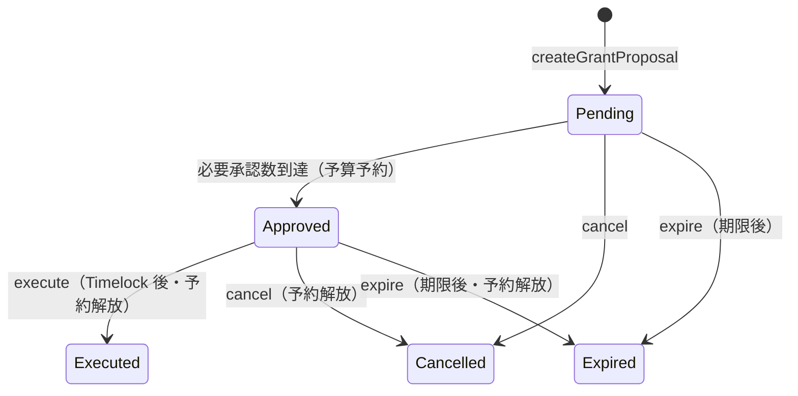

# FundOS — 特定目的基金（Phase 1 + 限定 Phase 2）

**寄付者が回収できず、管理者も単独で資金を抜けない、監査可能な JPYC 基金の最小安全構成。**

FundOS は ERC-4626 の換金可能ボルトではありません。保全元本と支出可能予算を分離し、通常運用時は承認済み助成 Proposal、終端時は固定受取先への承認済み解散以外で JPYC が流出しないことを保証します。

## FundOS の目的

高専生の活動支援など、**特定の公益目的**に資金を拘束するオンチェーン基金です。

- 寄付は不可逆（返金・引出・持分トークンなし）
- 助成は支出可能予算のみから実行
- 複数承認 + Timelock 後にのみ送金
- 緊急停止で外向き資金移動を遮断
- 現フェーズでは外部 DeFi 運用なし

## ERC-4626 Vault との違い

| 項目 | ERC-4626 Vault | FundOS Phase 1 |
|---|---|---|
| 寄付の扱い | `deposit` / `mint` で持分取得 | `donatePrincipal` / `fundGrantBudget`（不可逆） |
| 引出 | `withdraw` / `redeem` 可能 | **不可** |
| 持分トークン | ksJPYC 等を発行 | **発行しない** |
| 資金流出 | 保有者・管理者経路があり得る | 助成、または終端的な承認済み解散のみ |
| 会計 | `totalAssets()` 中心 | 保全元本 + 支出予算の二層会計 |
| 外部運用 | yieldSink / deployYield | **Phase 1 では未実装** |

## コントラクト構成

```
FundConstitution.sol   … 基金名・目的ハッシュ・JPYC アドレス等（デプロイ後不変）
TreasuryVault.sol      … JPYC 保管・会計・送金実行（GrantController のみ）
GrantController.sol    … 助成 Proposal の作成・承認・実行・緊急停止
```

### 保全元本 (`protectedPrincipal`)

```solidity
donatePrincipal(uint256 amount, bytes32 donorRef)
```

- 誰でも実行可能
- 返金不可・引出不可・助成に使用不可
- `donorRef` は個人を特定しないハッシュのみ

### 支出可能予算 (`availableGrantBudget`)

```solidity
fundGrantBudget(uint256 amount, bytes32 sourceRef)
```

- 誰でも実行可能
- **助成実行時のみ**消費される
- 返金不可
- Approved になった助成 Proposal は `reservedGrantBudget` として予約され、重複承認を防ぐ
- 実際に新規承認へ回せる額は `spendableGrantBudget = availableGrantBudget - reservedGrantBudget`

### 会計不変条件

```text
JPYC 実残高 >= protectedPrincipal + availableGrantBudget
reservedGrantBudget <= availableGrantBudget
reservedYieldSurplus <= accountingSurplus
```

超過分は `accountingSurplus`（誤送金等）。Surplus を管理者が引き出す機能はありません。運用益認定の Approved 案件は `reservedYieldSurplus` で予約されます。

## 運用益の予算振替（限定 Phase 2）

外部運用そのものはまだ実装していません。外部口座・将来の Strategy から JPYC が Treasury に戻ると、まず `accountingSurplus` になります。運用益であることをオフチェーン証憑で確認後、次の手順でのみ予算化できます。

1. Config が `createYieldAllocation(amount, evidenceHash, metadataURI)` を作成
2. Approver が複数承認（作成者の自己承認・二重承認不可）。必要数到達時に surplus を予約
3. 通常の Timelock 経過後、Executor が `executeYieldAllocation`
4. Treasury が同額を surplus から `availableGrantBudget` へ**会計上のみ振替**

この処理ではトークンを移動せず、保全元本を変更しません。コントラクトだけでは「誤送金」と「運用益」を識別できないため、`evidenceHash` と複数承認が運用益認定の根拠になります。

## 解散・残余財産処理（限定 Phase 2）

解散は通常の送金機能ではなく、取り消し可能な長期待機付き終端処理です。

1. Guardian が基金を停止
2. Config が法的決議の `resolutionHash` と `metadataURI` を添えて解散を開始
3. Treasury は `DissolutionPending` となり、新規寄付・予算入金を拒否
4. Approver が複数承認
5. **30日間**の解散専用 Timelock 後、Executor が実行
6. 全 JPYC を Constitution に固定された `dissolutionRecipient` へ送付
7. Treasury は永久に `Dissolved` となり、再開・再利用不可

Executor、Admin、Config のいずれも単独では受取先を変更できません。Guardian または提案者、Default Admin は実行前に解散をキャンセルできます。解散 Proposal は開始から90日で期限切れです。

## 助成 Proposal ライフサイクル



1. **Proposer** が Proposal 作成（recipient / amount / purposeId / evidenceHash / metadataURI）
2. **Approver** が承認（自己承認・二重承認不可）。`spendableGrantBudget` が不足している場合は承認不可
3. 必要承認数に達すると **Approved**、予算を予約し `executableAt = now + timelock`
4. **Executor** が Timelock 経過後・期限内に `executeGrantProposal`
5. Treasury から recipient へ JPYC 送金、`availableGrantBudget` と予約を減算
6. 期限切れ後は誰でも `expireGrantProposal` でき、予約を解放する

### 設定変更（Timelock 付き）

CONFIG はパラメータを即時変更できません。

1. Config が `proposeConfiguration(...)` を作成
2. **現在の** `timelockDuration` 経過後に `executeConfiguration`
3. Config / Admin / Guardian は実行前に `cancelPendingConfiguration` 可能

制約:

- `requiredApprovals` の下限は **2**
- Timelock 短縮も「短縮前の長い待機」を経るため、即時弱体化できない

## 権限モデル（AccessControl）

| Role | 権限 |
|---|---|
| `DEFAULT_ADMIN_ROLE` | Role 管理のみ（送金不可） |
| `PROPOSER_ROLE` | Proposal 作成 |
| `APPROVER_ROLE` | Proposal 承認 |
| `EXECUTOR_ROLE` | 承認済み Proposal の実行 |
| `GUARDIAN_ROLE` | **緊急停止のみ**（解除不可） |
| `CONFIG_ROLE` | 上限・承認数・Timelock・有効期間の**提案**、停止解除、運用益認定・解散の開始 |

`AccessControlDefaultAdminRules` により Default Admin の移管に遅延を設定します。本番では **Safe や TimelockController** を Admin / Config に指定してください。

## 緊急停止

- **Guardian** のみ `pause()` 可能
- **停止解除**は Default Admin または Config Role のみ（Guardian 単独では不可）
- 停止中: 助成実行・設定変更を禁止。唯一の外向き送金例外は、複数承認と30日待機を終えた終端的解散
- **寄付受付は停止しない** — 停止中も JPYC が外部へ流出する経路は存在せず、追加の支援資金を受け入れられるため

## 現フェーズで外部運用を行わない理由

- `totalAssets()` 前提の運用ロジックは会計を曖昧にし、元本と予算の分離を壊す
- 外部 DeFi 接続は新たな流出・評価リスクを生む
- Phase 1 は **安全性と監査可能性の検証**に集中する

## セキュリティ上の制約

- `SafeERC20` + `ReentrancyGuard` + Checks-Effects-Interactions
- 任意送金関数なし / JPYC の `rescueToken` 禁止
- `receive()` / fallback なし
- Solidity custom error + 重要イベント
- 通常送金経路は `executeGrantProposal` のみ。別経路は固定受取先への終端的 `executeDissolution` のみ

## 開発環境

### 前提

- [Foundry](https://book.getfoundry.sh/)
- Node.js 20+

### テスト

```bash
cd contracts
forge fmt
forge build
forge test -vv
```

### Agent（読み取り専用監視）

```bash
cd agent
npm install
npm run build

RPC_URL=https://polygon-rpc.com \
TREASURY_ADDRESS=0x... \
GRANT_CONTROLLER_ADDRESS=0x... \
npm run monitor
```

秘密鍵は不要です。

### デプロイ例（ローカル / テストネット）

```bash
cd contracts
export ADMIN=0x...
export PROPOSER=0x...
export APPROVER=0x...
export EXECUTOR=0x...
export GUARDIAN=0x...
export CONFIG=0x...          # 省略時は ADMIN
export USE_MOCK_JPYC=true    # ローカル検証専用。省略時は false(本番 JPYC を要求)

forge script script/DeployFundOS.s.sol:DeployFundOS \
  --rpc-url $RPC_URL \
  --broadcast
```

本番 JPYC を使う場合(`USE_MOCK_JPYC` はデフォルトで false なので指定不要):

```bash
export JPYC_TOKEN=0xE7C3D8C9a439feDe00D2600032D5dB0Be71C3c29
```

Mock JPYC は誰でも無制限に mint できるテスト専用トークンです。明示的に `USE_MOCK_JPYC=true` を指定した場合のみデプロイされます。

`.env.example` を参照してください。**実在の秘密鍵やアドレスをコードに埋め込まないでください。**

## 実資金を入れる前に必要な監査

- 第三者によるスマートコントラクト監査
- Safe / Timelock によるマルチシグ運用設計のレビュー
- Role 保有者・手続きの運用マニュアル整備
- 助成 evidence のオフチェーン保管プロセス
- 法人・税務・資金決済法などの法務確認（高専・公益法人との契約は Phase 2）

## 今後の Phase 2 設計案（未実装）

- 法人名義証券口座との会計連携
- 外部運用戦略（Strategy Registry / Adapter）
- 運用資産を含む NAV 計算
- インフレ調整後の実質元本
- 高専・公益法人との法的契約

## ライセンス

MIT
